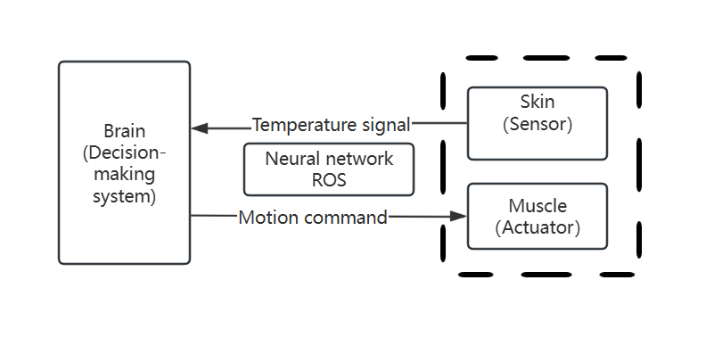

# 1.1.1 Robot and ROS

When I first started job hunting and attended interviews, the interviewer asked, "What do you think a robot is?" I replied, "A machine that can automatically perform certain tasks (like moving and cleaning) similar to a human." I answered this way because a robot's structure and behavior are quite similar to those of a human body. Let's take a simple action as an example: when you feel hot, you turn on the air conditioner. If we use a robot to simulate this behavior process:

As shown in Figure 1-1, your skin is equivalent to a robot's sensors, such as a temperature sensor that can measure temperature; your muscles are like a robot's actuators, such as a servo motor that can control angles; and the brain corresponds to a robot's decision-making system. The nerves connecting the skin, muscles, and brain are analogous to a neural network. It's easy to see that ROS's role in a robot is to send sensor data to the decision-making system and then relay the decision-making system's output to the actuators for execution.

Figure 1-1 Comparison of Robot and Human Behavior

In 2006, Eric Berger and Keenan Wyrobek found through research that robot companies at the time were spending 80% of their effort building communication mechanisms and basic tools for robots, leaving little time to refine the decision-making systems. More oddly, even within the same organization, every time they developed a new robot, they would start from scratch to build the communication mechanisms and tools, wasting a lot of time reinventing the wheel. The time spent on reinventing the wheel versus new research by different companies is shown in Figure 1-2.

Enough of This - Fed Up
Reinventing the Wheel - Reinventing the Wheel
New Research - New Research

Figure 1-2 The proportion of time spent on reinventing the wheel and new research by different companies

ROS emerged against this backdrop. You smart folks might have already guessed that ROS is essentially a collection of software libraries (with communication at its core) and tools for quickly building robots. Although ROS solved the problem of reinventing the wheel in robot development, with the continuous advancement of robot software and hardware and the expansion of application scenarios, ROS has revealed issues such as a lack of stability, real-time performance, and security in communication. Hence, ROS 2 has begun to take the stage.

ROS 2 uses third-party communication components instead of the ones in ROS 1, making data transmission more stable and powerful. Additionally, ROS 2 has introduced a new C++ standard, bringing significant improvements in code standardization and interface consistency. Therefore, in this book, we will introduce the latest ROS 2.

How does ROS 2 go further than ROS 1? With curiosity, let's look at ROS 2's system architecture together and uncover its mysteries.