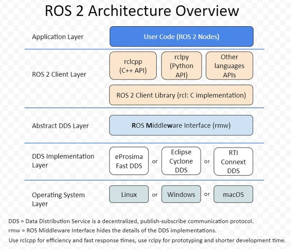

.. _ros2_system_architecture:

1.1.2 ROS 2 System Architecture
================================

To help you better understand ROS 2, let's first take a look at its system architecture. The ROS 2 system architecture can be divided into five layers: the operating system layer, the DDS implementation layer, the DDS interface layer, the ROS 2 client layer, and the application layer.

1.1.2.1 Operating System Layer
------------------------------

ROS 2 is built on Linux, Windows, and macOS systems. This layer provides ROS 2 with various basic hardware drivers, such as network card drivers, common USB drivers, and common camera drivers.

1.1.2.2 DDS Implementation Layer
--------------------------------

As previously mentioned, the core communication of ROS 2 is implemented using a third-party communication component, which is the Data Distribution Service (DDS). DDS is based on the Real-time Publish-Subscribe (RTPS) protocol for data distribution.

1.1.2.3 DDS Interface Layer
---------------------------

Since ROS 2 needs to support DDS from different vendors while maintaining consistency, ROS 2 defines the ROS Middleware Interface (RMW). Different DDS implementations provide a unified interface for the ROS 2 client layer. For example, the DDS interface layer is like the standard of a USB interface, while the DDS implementation layer is like the USB devices produced by different manufacturers according to this standard.

1.1.2.4 ROS 2 Client Layer
-------------------------

The ROS 2 client layer provides ROS 2 client libraries (ROS 2 Client Library, RCL) in different programming languages. Using the interfaces provided by these libraries, you can call the core functions of ROS 2, such as topics, services, parameters, and action communication mechanisms.

1.1.2.5 Application Layer
-------------------------

All programs developed based on RCL belong to the application layer. For example, the TurtleSim simulator and ROS QT tools that we will use later are all based on this layer. Of course, the robot applications that we will develop in the future also belong to this layer.

After understanding the architecture of ROS 2, I believe you will have a better understanding when combined with Figure 1-3.

   Figure 1-3: ROS 2 System Architecture Diagram