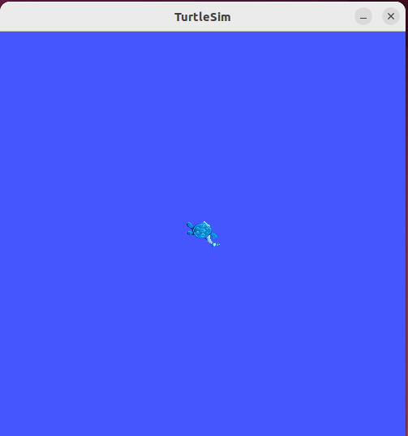

1.3.1 Launching the Turtle Simulator
===================================

The mascot program in ROS 2, the little turtle, consists of a simple graphical interface where we can control the turtle's movement using the keyboard. Let's launch the turtle simulator and the keyboard control program to see it in action!

Use the shortcut `Ctrl + Alt + T` to open a new terminal and enter the command shown in Listing 1-6. This will start the turtle simulator as shown in Figure 1-19. When typing commands in the terminal, you can use the `Tab` key for auto-completion. For example, when typing the command below, simply type `ros2 r` and press `Tab`, and it will auto-complete to `ros2 run`. The same applies to the rest of the command.

**Listing 1-6: Running the Turtle Simulator Node**

.. code-block:: bash

   $ ros2 run turtlesim turtlesim_node
   ---
   [INFO] [1698357677.019198100] [turtlesim]: Starting turtlesim with node name /turtlesim
   [INFO] [1698357677.026135400] [turtlesim]: Spawning turtle [turtle1] at x=[5.544445], y=[5.544445], theta=[0.000000]

    Figure 1-19 Turtle Simulator Interface

Let’s briefly analyze the startup command for the turtle simulator. It consists of four parts:

- **ros2**: Indicates the use of the ROS 2 framework.
- **run**: Specifies the action to run a program.
- **turtlesim**: The name of the program package, which contains multiple executable programs.
- **turtlesim_node**: One of the executable programs within the `turtlesim` package.

Combined, the command means: **Use ROS 2 to run the `turtlesim_node` executable file from the `turtlesim` package.**