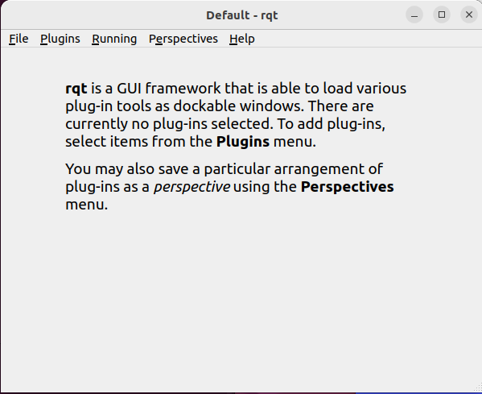
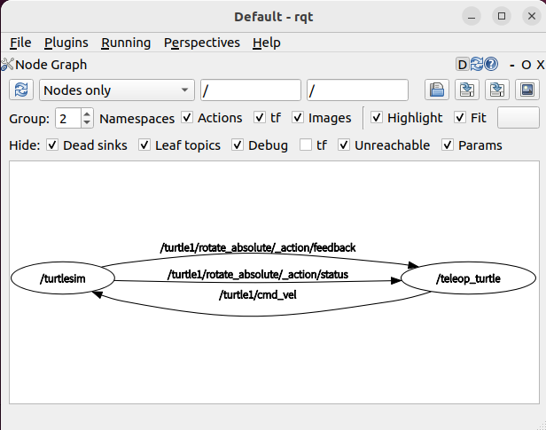

1.3.3 Simple Analysis of the Turtle Example
==========================================

Why can we control the turtle simulator window by pressing keys in the keyboard control window? There must be some mechanism connecting them behind the scenes. Using the node relationship graph tool provided by ROS 2, we can quickly visualize this connection. Let’s try it out.

Do not close the simulator and keyboard control terminals. Open a new terminal again and enter the command shown in Listing 1-8 to open the default rqt interface, as shown in Figure 1-21.

**Listing 1-8: Command to Open the rqt Tool**

.. code-block:: bash

   $ rqt

    Figure 1-21 Default RQT Interface

Next, in the rqt toolbar, select **Plugins > Introspection > Node Graph**. After opening it, click the refresh button in the upper-left corner to obtain the latest node relationships in the current system, as shown in Figure 1-22.

    Figure 1-22 Node Graph Plugin Interface

As shown in Figure 1-25, the keyboard control node `/teleop_turtle` has a line pointing from the right to the turtle node `/turtlesim`, with the label `/turtle1/cmd_vel` on the line. This `/turtle1/cmd_vel` is the topic name. The starting point of the line, the keyboard control node, is the publisher of the topic, and the endpoint, the turtle node, is the subscriber of the topic. Therefore, the turtle node and the keyboard control node are connected through the topic communication mechanism, one of the four major communication mechanisms in ROS 2.

Using the powerful debugging tool `rqt`, we quickly identified the connection. This also highlights the richness of tools available in ROS 2.