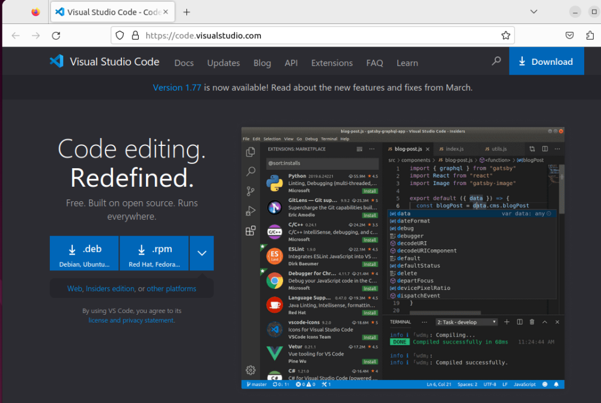
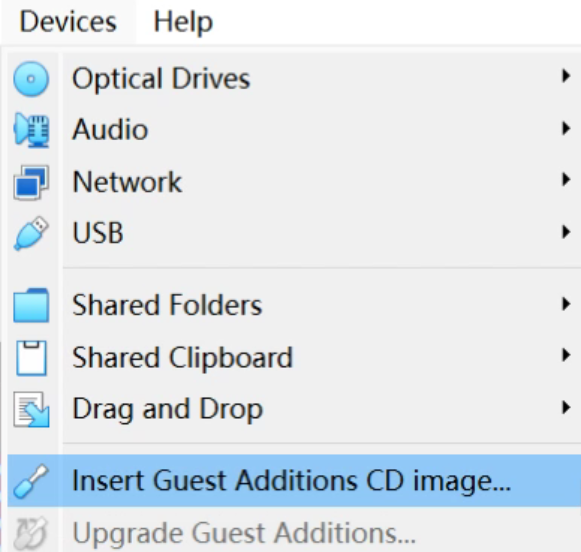
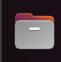
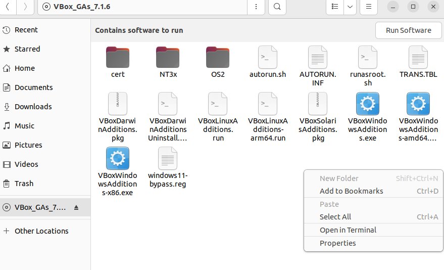

1.4.2 Installing Software in Linux
=================================

When installing ROS 2, we used an installation tool to quickly complete the process. However, not all software comes with such an installation tool, so it’s important to master other installation methods. Here, we’ll try installing VS Code, an editor we’ll use in subsequent development, by downloading its installation package.

First, open the Firefox browser from the top-left corner of the Linux desktop and visit the official VS Code website at https://code.visualstudio.com/. The download interface is shown in Figure 1-24.

    Figure 1-24 VS Code Download Interface

Click the blue `.deb` button to start the download. The file will be downloaded to the `~/Downloads` directory by default. After the download is complete, you’ll notice that the software installation package on Ubuntu has a `.deb` extension. Let’s proceed to install it.

Open a new terminal and enter the command in Listing 1-18 to install VS Code. Note that the file name depends on the version you downloaded. Here, we use the `sudo dpkg -i` command to install the software. `dpkg` is a package management tool in Ubuntu used to install, view, and uninstall software packages. Adding `sudo` before `dpkg` means executing the command with administrator privileges, and the `-i` after `dpkg` stands for installation.

**Listing 1-18: Installing VS Code Using dpkg**

.. code-block:: bash

   $ cd ~/Downloads  # Use Win + Space to switch between Chinese and English input methods
   $ sudo dpkg -i ./code_1.77.0-1680085573_amd64.deb
   ---
   [sudo] password for fishros:
   (Reading database ... 279532 files and directories currently installed.)
   Preparing to unpack .../code_1.77.3-1681292746_amd64.deb ...
   ...

Using `dpkg`, you can directly install downloaded `.deb` packages. Another more advanced package management tool, `apt`, can automatically download and install software by its name. As an example, let’s install `git`, a version control tool we’ll use in later learning.

Enter the `git` command in the terminal, as shown in Listing 1-19. At this point, it will show that the command is not found and suggest using the `apt` command to install it.

**Listing 1-19: Testing the git Command**

.. code-block:: bash

   $ git
   ---
   Command 'git' not found, but can be installed with:
   sudo apt install git

Following the prompt in Listing 1-19, enter the installation command in Listing 1-20.

**Listing 1-20: Installing git Using apt**

.. code-block:: bash

   $ sudo apt install git
   ---
   ...
   Need to get 3,166 kB of archives.
   After unpacking, 18.9 MB of additional disk space will be used.
   Get:1 https://mirrors.ustc.edu.cn/ubuntu jammy-updates/main amd64 git amd64 1:2.34.1-1ubuntu1.10 [3,166 kB]
   Fetched 3,166 kB in 0s (16.6 MB/s)
   Selecting previously unselected package git.
   (Reading database ... 291143 files and directories currently installed.)
   Preparing to unpack .../git_1%3a2.34.1-1ubuntu1.10_amd64.deb ...
   Unpacking git (1:2.34.1-1ubuntu1.10) ...
   Setting up git (1:2.34.1-1ubuntu1.10) ...

After the installation is complete, enter the `git` command again to test it. This time, it will not show that the command is not found, as shown in Listing 1-21.

**Listing 1-21: Testing git After Installation**

.. code-block:: bash

   $ git
   ---
   usage: git [--version] [--help] [-C <path>] [-c <name>=<value>]
              [--exec-path[=<path>]] [--html-path] [--man-path] [--info-path]
              [-p | --paginate | -P | --no-pager] [--no-replace-objects] [--bare]
              [--git-dir=<path>] [--work-tree=<path>] [--namespace=<name>]
              [--super-prefix=<path>] [--config-env=<name>=<envvar>]
              <command> [<args>]

   These are common Git commands used in various situations:
   start a working area (see also: git help tutorial)
      clone      Clone a repository into a new directory
      init       Create an empty Git repository or reinitialize an existing one

In addition to using `dpkg` and `apt`, you can also run scripts for installation. Let’s learn about script installation by installing VirtualBox Guest Additions. If you’re not using a virtual machine, you can skip this step. In the virtual machine toolbar, select "Devices," then choose "Insert Guest Additions CD Image," as shown in Figure 1-25.

    Figure 1-25 Select to Install Enhanced Features

The Guest Additions include features such as shared clipboard, shared folders, and automatic screen resolution adjustment. Next, double-click the file manager icon in the virtual machine, as shown in Figure 1-26, to open the file manager.

    Figure 1-26 File Manager Icon

Next, click on the folder starting with `VBox_GAs` in the bottom-left corner of the file manager. Then, right-click on a blank area within that folder and select "Open in Terminal," as shown in Figure 1-27.

    Figure 1-27 Installation Package Virtual Disc File

In Linux, terminal scripts usually end with `.sh`. Next, in the opened terminal, enter the command in Listing 1-22 to execute the automatic installation script.

**Listing 1-22: Automatic Installation Script**

.. code-block:: bash

   $ ./autorun.sh
   ---
   Verifying archive integrity...  100%   MD5 checksums are OK. All good.
   Uncompressing VirtualBox 7.0.6 Guest Additions for Linux  100%
   VirtualBox Guest Additions installer
   ...
   The system is restarted.
   Press Return to close this window...

After following the prompts to complete the installation, simply close the window. If you need to install some commonly used software in Linux, you can often do so with a single `apt` command. Sometimes, this can feel even more convenient than installing software on Windows.