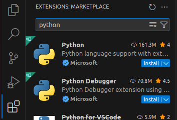

ROS 2 provides a rich Python client library, allowing you to create nodes with simple function calls.

Create a `chapt2/` folder in your home directory and open it with VS Code. Then, create a `ros2_python_node.py` file and write the content from Listing 2-1 in the file.

**Listing 2-1: A Simple Python Node**

.. code-block:: python

   import rclpy
   from rclpy.node import Node

   def main():
       rclpy.init()
       node = Node("python_node")
       rclpy.spin(node)
       rclpy.shutdown()

   if __name__ == "__main__":
       main()

As shown in Listing 2-1, we first import the ROS 2 Python client library `rclpy`, and then import the `Node` class from the `node` module of `rclpy`. Next, we define a `main` function. Inside the function, we first call the `init` method of `rclpy` to allocate resources for communication. Then, we create an instance of the `Node` class named `python_node`. With the `node` instance, we can use it to subscribe to or publish topics. Communication is not the focus of this section, so no operations are performed here.

After creating the node, we use the `spin` method to start the node. As the name suggests, the `spin` method continuously checks for new events, such as incoming topic data, until the node is shut down. The subsequent `rclpy.shutdown()` method is used to clean up allocated resources and confirm that the node has been shut down.

After understanding the purpose of each line of code, let’s run the code. Use the shortcut `Ctrl + Shift + ~` to quickly open an integrated terminal in VS Code, and then enter the command in Listing 2-2 to run the node.

**Listing 2-2: Running the Node Using Python**

.. code-block:: bash

   $ python3 ros2_python_node.py

After running, you’ll notice that the terminal doesn’t display any output or prompts. Don’t doubt the code—the node is actually running. Use the shortcut `Ctrl + Shift + 5` to add a new terminal next to the existing one in VS Code, and then enter the command in Listing 2-3.

**Listing 2-3: Querying the Node List Using the Command Line**

.. code-block:: bash

   $ ros2 node list
   ---
   /python_node

The `ros2 node list` command in Listing 2-3 is one of the commands under the node module of the ROS 2 command-line tool. It is used to view the current list of nodes. Seeing `/python_node` means our first ROS 2 node has successfully started. However, starting without any output isn’t very friendly, so let’s modify the `main` function to add a print statement, as shown in Listing 2-4.

**Listing 2-4: Node Code with Added Print Statement**

.. code-block:: python

   def main():
       rclpy.init()
       node = Node("python_node")
       node.get_logger().info('Hello Python Node!')
       rclpy.spin(node)
       rclpy.shutdown()

Here, we’ve added a print statement, but instead of using the familiar `print` function, we first call `get_logger()` through the `node` instance to get the logger, and then use the logger’s `info` method to print a message.

Let’s run and test it. In the terminal where the node was running, enter the `Ctrl + C` command to interrupt the currently running program. Then, enter and run the command in Listing 2-5.

**Listing 2-5: Running the Python Node with Logging**

.. code-block:: bash

   $ python3 ros2_python_node.py
   ---
   [INFO] [1699126891.009349500] [python_node]: Hello Python Node!

Here, you can see not only the content we wanted to print but also the log level, timestamp, and node information. If you want to see more log information, you can modify the log format using the `RCUTILS_CONSOLE_OUTPUT_FORMAT` environment variable. Use the setting in Listing 2-6 to print the function name and line number along with the message.

**Listing 2-6: Using Environment Variables to Print More Information**

.. code-block:: bash

   $ export RCUTILS_CONSOLE_OUTPUT_FORMAT=[{function_name}:{line_number}]:{message}
   $ python3 ros2_python_node.py
   ---
   [main:7]: Hello Python Node!

Using `{}` to enclose specific keywords represents the corresponding message. In addition to the three used in the code above, there are also `severity` for log level, `name` for logger name, `file_name` for file name, `time` for timestamp, and `time_as_nanoseconds` for timestamp in nanoseconds.

With this, our first Python node is complete. However, you might notice that there are no code hints while writing. This is because the Python plugin is not installed. As shown in Figure 2-1, open the VS Code extensions, search for "Python," and install the first plugin.

    Figure 2-1 Editing Interface