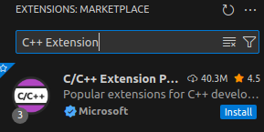
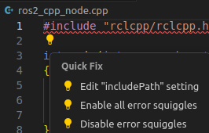
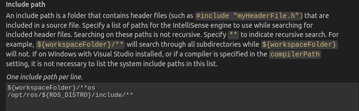
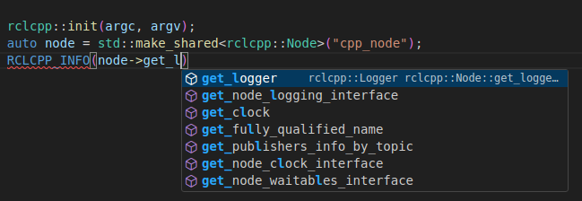
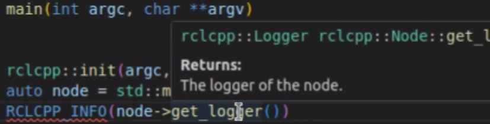

2.1.2 C++ Example
=================

While Python is often praised for its simplicity with the phrase "Life is short, I use Python," its efficiency as an interpreted language can be a disadvantage in actual robotics product development. Therefore, while learning how to write nodes in Python, it’s also beneficial to learn the C++ implementation to complement each other’s strengths and weaknesses.

Open the `chapt2/` folder with VS Code, create a new file `ros2_cpp_node.cpp`, and write the code shown in Listing 2-7.

**Listing 2-7: A Simple C++ Node**

.. code-block:: cpp

   #include "rclcpp/rclcpp.hpp"

   int main(int argc, char **argv)
   {
       rclcpp::init(argc, argv);
       auto node = std::make_shared<rclcpp::Node>("cpp_node");
       RCLCPP_INFO(node->get_logger(), "Hello C++ Node!");
       rclcpp::spin(node);
       rclcpp::shutdown();
       return 0;
   }

In Listing 2-7, we first include the `rclcpp.hpp` header file from the `rclcpp` library. Then, in the `main` function, we call the `init` function to initialize and allocate resources, preparing for communication. Next, we use `std::make_shared` to create a `rclcpp::Node` object with the node name and return a smart pointer to this object. The `auto` keyword is used for type inference, deducing the type of `node` based on the return value. After that, we use the `RCLCPP_INFO` macro to call the node’s logger and print a log message. Finally, we use the `spin` function to start the node and continuously check for events, and call `rclcpp::shutdown()` to clean up resources at the end.

If you have a background in C, understanding Listing 2-7 shouldn’t be difficult. What might confuse you is the use of smart pointers for creating the node object, as this is a new feature in C++11. For now, you only need a basic understanding, as we’ll revisit this topic later when discussing ROS 2 basics. Additionally, the `::` symbol is the scope resolution operator, used to access elements within a namespace or class. For example, the `init`, `spin`, and `shutdown` functions are all under the `rclcpp` namespace, so they are called using `rclcpp::` followed by the function name.

Like any regular C++ program, the code needs to be compiled to generate an executable. For complex code, we use the CMake tool to build it. Following the `CMakeLists.txt` from Section 1.4.4, create a file with the same name in the `chapt2/` directory, with the content shown in Listing 2-8.

**Listing 2-8: chapt2/CMakeLists.txt**

.. code-block:: cmake

   cmake_minimum_required (VERSION 3.8)
   project (ros2_cpp)
   add_executable(ros2_cpp_node ros2_cpp_node.cpp)

We still use CMake to build and compile. Open the terminal, navigate to the `chapt2/` directory, and enter the command in Listing 2-9.

**Listing 2-9: Generating the Executable**

.. code-block:: bash

   $ cmake .
   ---
   -- The C compiler identification is GNU 11.4.0
   ...
   -- Build files have been written to: /home/fishros/chapt2

   $ make
   ---
   /home/fishros/chapt2/ros2_cpp_node.cpp:1:10: fatal error: rclcpp/rclcpp.hpp: No such file or directory
       1 | #include "rclcpp/rclcpp.hpp"
         |          ^~~~~~~~~~~~~~~~~~~
   compilation terminated.
   make[2]: *** [CMakeFiles/ros2_cpp_node.dir/build.make:76: CMakeFiles/ros2_cpp_node.dir/ros2_cpp_node.cpp.o] Error 1
   make[1]: *** [CMakeFiles/Makefile2:83: CMakeFiles/ros2_cpp_node.dir/all] Error 2
   make: *** [Makefile:91: all] Error 2

Unfortunately, when using the `make` command to compile, you’ll encounter an error like the one shown in Listing 2-9. This is because the code includes the `rclcpp.hpp` header file, which is not in the system’s default header file directory but rather in the ROS 2 installation directory. We can use CMake directives to find and add dependencies for `ros2_cpp_node`. Append the instructions in Listing 2-10 to the end of `chapt2/CMakeLists.txt`.

**Listing 2-10: Adding and Linking Dependencies**

.. code-block:: cmake

   # Find the path to the rclcpp header and library files
   find_package(rclcpp REQUIRED)
   # Include the header files for the executable
   target_include_directories(ros2_cpp_node PUBLIC ${rclcpp_INCLUDE_DIRS})
   # Link the library files for the executable
   target_link_libraries(ros2_cpp_node ${rclcpp_LIBRARIES})

The three lines in Listing 2-10 complete the steps of finding the dependency library, adding the header file path, and linking the dynamic library. The `find_package` directive searches for dependencies in additional directories. After finding the `rclcpp` header and library files, it also recursively finds the dependencies required by `rclcpp`.

After adding these lines, run `make` again, and you’ll see that the executable `ros2_cpp_node` has been generated. The command and result are shown in Listing 2-11.

**Listing 2-11: Running the Node**

.. code-block:: bash

   $ ./ros2_cpp_node
   ---
   [INFO] [1698472590.755824396] [cpp_node]: Hello C++ Node!

Open another terminal and enter the two commands in Listing 2-12.

**Listing 2-12: Viewing the Node List and Information**

.. code-block:: bash

   $ ros2 node list
   ---
   /cpp_node

   $ ros2 node info /cpp_node
   ---
     Subscribers:
       /parameter_events: rcl_interfaces/msg/ParameterEvent
     Publishers:
       /parameter_events: rcl_interfaces/msg/ParameterEvent
       /rosout: rcl_interfaces/msg/Log
     Service Servers:
       /cpp_node/describe_parameters: rcl_interfaces/srv/DescribeParameters
       /cpp_node/get_parameter_types: rcl_interfaces/srv/GetParameterTypes
       /cpp_node/get_parameters: rcl_interfaces/srv/GetParameters
       /cpp_node/list_parameters: rcl_interfaces/srv/ListParameters
       /cpp_node/set_parameters: rcl_interfaces/srv/SetParameters
       /cpp_node/set_parameters_atomically: rcl_interfaces/srv/SetParametersAtomically
     Service Clients:

     Action Servers:

     Action Clients:

You can see that the first command returns `/cpp_node`, and the second command, `ros2 node info`, is another command under the node module of the ROS 2 command-line tool. It is used to view information about a specific node. After running it, you’ll see details about the node’s subscribers, publishers, services, and more.

With this, your first C++ ROS 2 node is complete. However, the above steps have left a small trap for the next part of the learning process. The `CMakeLists.txt` file will be searched and mistakenly used by the ROS 2 build tool we’ll learn about next. To ensure smooth progress in the upcoming lessons, please delete or rename the `chapt2/CMakeLists.txt` file. Additionally, did you notice that there were no code hints while writing the code? The answer is likely no, and the reason is that we haven’t installed and configured the C++ plugin for VS Code. Open the VS Code extensions, search for "C++ Extension," and install the first plugin shown in Figure 2-4.

    Figure 2-4 Install C/C++ Extension Pack

After the installation is complete, return to the code file. As shown in Figure 2-5, you’ll notice that the line containing the header file now has a red squiggly underline. Click on that line with your mouse, and VS Code will display a quick-fix lightbulb. Click on "Edit 'includedPath' settings" to jump to the settings interface.

    Figure 2-5 Edit Header File Paths

As shown in Figure 2-6, add the directory `/opt/ros/${ROS_DISTRO}/include/**` (where `${ROS_DISTRO}` is your ROS 2 distribution name, e.g., `humble`) to the settings interface. Then, click on a blank area outside the input box to save the changes.

    Figure 2-6 Include ROS 2 Installation Path

Next, reopen the code file that previously had errors. You’ll notice that the header file error has disappeared, and both code hints (as shown in Figure 2-7) and function comments (as shown in Figure 2-8) are now working properly.

    Figure 2-7 Check Code Hinting

    Figure 2-8 View Function Explanation

After configuring the header file directory, a `.vscode/c_cpp_properties.json` file will be generated in the current working directory of VS Code. The header file configuration will be written under the `includePath` item in this file. Therefore, you can also directly edit this file to add header file configurations. Note that since this file only exists in the current directory, you’ll need to reconfigure it if you change the working directory.