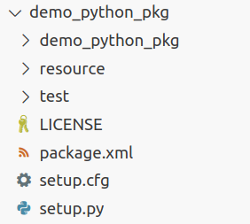

2.2.1 Writing Python Nodes in a Package
======================================

First, open the `chapt2` folder in your home directory using VS Code and open the integrated terminal. Enter the command shown in Listing 2-13.

**Listing 2-13: Creating a Python Package**

.. code-block:: bash

   $ ros2 pkg create demo_python_pkg --build-type ament_python --license Apache-2.0
   ---
   going to create a new package
   package name: demo_python_pkg
   destination directory: /home/fishros/chapt2
   package format: 3
   version: 0.0.0
   description: TODO: Package description
   maintainer: ['fishros <fishros@todo.todo>']
   licenses: ['Apache-2.0']
   build type: ament_python
   dependencies: []
   …

In Listing 2-13, `ros2 pkg create` is a command under the `pkg` module of the ROS 2 command-line tool, used to create a package. `demo_python_pkg` is the name of the package, and the `--build-type ament_python` flag specifies that the package’s build type is `ament_python`. The `--license Apache-2.0` flag declares the open-source license for the package. From the log, it’s clear that this command creates a `demo_python_pkg` folder in the current terminal directory and generates some default files and folders within it. Expand this folder in the VS Code Explorer on the left to see the contents as shown in Figure 2-9.

    Figure 2-9 demo_python_pkg Package Structure Diagram

The analysis of the file structure within this package will be covered in the next section. First, let’s learn how to write a node within the package. Create a new file `python_node.py` in the `demo_python_pkg/demo_python_pkg` directory, and then enter the code shown in Listing 2-14.

**Listing 2-14: Simplest Python Node**

.. code-block:: python

   import rclpy
   from rclpy.node import Node

   def main():
       rclpy.init()
       node = Node("python_node")
       node.get_logger().info('Hello Python Node!')
       rclpy.spin(node)
       rclpy.shutdown()

This code is taken from the Python node we created in Section 2.1.1. However, if you look closely, you’ll notice that only the `main` function is defined here, and the code to call it has been removed. So, how do we run the `main` function? The answer is to tell the package where the `main` function is located. Open `demo_python_pkg/setup.py` and add `'python_node = demo_python_pkg.python_node:main',` under `console_scripts`. The added code and its location are shown in Listing 2-15.

**Listing 2-15: Adding Configuration to Register the Python Node**

.. code-block:: python

   …
       tests_require=['pytest'],
       entry_points={
           'console_scripts': [
               'python_node = demo_python_pkg.python_node:main',
           ],
   …

The `setup.py` file is a commonly used build configuration file in Python development. The added line means that executing `python_node` is equivalent to running the `main` function in the `python_node` file under the `demo_python_pkg` directory. After adding this, open `demo_python_pkg/package.xml` and add the dependency information. The added content and its location are shown in Listing 2-16.

**Listing 2-16: Adding rclpy Dependency Declaration in demo_python_pkg/package.xml**

.. code-block:: xml

   <?xml version="1.0"?>
   <?xml-model href="http://download.ros.org/schema/package_format3.xsd" schematypens="http://www.w3.org/2001/XMLSchema"?>
   <package format="3">
     …
     <license>Apache-2.0</license>
     <depend>rclpy</depend>
     <test_depend>ament_copyright</test_depend>
     …
   </package>

The `package.xml` file is the manifest file for ROS 2 packages, which will be explained in detail in the next section. Here, we add `<depend>rclpy</depend>` because we use the `rclpy` library in our code, so it needs to be declared in the manifest file.

Next, you can build the package in the `chapt2` directory using the command in Listing 2-17.

**Listing 2-17: Building the Package Using colcon in the chapt2 Directory**

.. code-block:: bash

   $ colcon build
   ---
   Starting >>> demo_python_pkg
   Finished <<< demo_python_pkg [0.58s]

   Summary: 1 package finished [0.69s]

In Listing 2-17, `colcon` is the tool used in ROS 2 to build packages. Using `colcon build` here will build all packages in the current and subdirectories.

After the build is complete, you’ll notice that three new folders—`build`, `install`, and `log`—have been created in the `chapt2` directory. The `build` folder contains intermediate files generated during the build process. The `install` folder is where the build results are placed. Opening the `install` folder, you’ll see the name of the `demo_python_pkg` package, and the executable `python_node` is placed in a specific directory within it. The `log` folder contains various log information generated during the build process. After building, how do we run it? By analogy with the command used to run the turtle simulator, use the command in Listing 2-18.

**Listing 2-18: Running the python_node Node**

.. code-block:: bash

   $ ros2 run demo_python_pkg python_node
   ---
   Package 'demo_python_pkg' not found

After running the command in Listing 2-18, you’ll see a message indicating that the `demo_python_pkg` package cannot be found. As explained in Section 1.4.5, `ros2 run` looks for packages using the `AMENT_PREFIX_PATH` environment variable, which by default points to the ROS 2 system installation directory. The `demo_python_pkg` package is installed in the `install` directory, so we need to modify `AMENT_PREFIX_PATH` to help `ros2 run` find the package. In the `install` directory, there is a `setup.bash` script. Running it will automatically modify the `AMENT_PREFIX_PATH` environment variable. The command is shown in Listing 2-19.

**Listing 2-19: Setting Environment Variables Using source**

.. code-block:: bash

   $ source install/setup.bash
   $ echo $AMENT_PREFIX_PATH
   ---
   /home/fishros/chapt2/install/demo_python_pkg:/opt/ros/humble

From Listing 2-19, you can see that after running `source`, the `AMENT_PREFIX_PATH` environment variable now includes the path to the newly built package. Now, running the node again will execute it successfully. The command and result are shown in Listing 2-20.

**Listing 2-20: Running the python_node Node**

.. code-block:: bash

   $ ros2 run demo_python_pkg python_node
   ---
   [INFO] [1680635227.584828594] [python_node]: Hello Python Node!

Note that since environment variables are only valid for the current terminal context, you’ll need to re-run `source` in a new terminal to find the node.

At this point, you’ve successfully created a Python package, written a Python node within it, and built and run the node. Next, let’s analyze the Python package together.