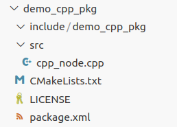

2.3.2 Package Structure Analysis
================================

Open the `demo_cpp_pkg` folder in the VS Code Explorer and fully expand its subfolders. You’ll see the directory structure as shown in Figure 2-12.

    Figure 2-12 C++ Package Structure

The structure is very concise, with two folders and three files in the directory. Let’s go through them one by one.

- **include**
  This directory is used to store C++ header files. If you need to write header files, they are generally placed here.

- **src**
  This is the source code directory, where you can place node code or other related code.

- **CMakeLists.txt**
  This file is the configuration file for the CMake build system used in C/C++. By adding directives to this file, you can complete tasks such as dependency lookup, adding executables, and installation.

- **LICENSE**
  This file is the license for the package. When creating the package, the `--license Apache-2.0` parameter was used, and the content of this file is the Apache-2.0 license agreement. A brief introduction to this license was provided in Section 2.2.2.

- **package.xml**
  This file is the manifest file for the package. Every ROS 2 package contains this file, and its functionality is the same as the `package.xml` in Python packages, as described in Section 2.2.2. Its additional uses will be explained in the next section.

Of course, in addition to the files and folders mentioned above, you can also add other directories and files during actual development, such as a `map` directory for storing maps or a `config` directory for storing parameters.