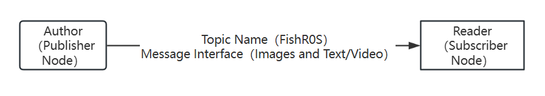
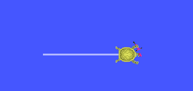

3.1 Introduction to Topic Communication
=====================================

ROS 2's topic mechanism revolves around four key elements: **publishers**, **subscribers**, **topic names**, and **topic types**. As illustrated in Figure 3-1:
- A **publisher** is analogous to the author of a public account.
- A **subscriber** corresponds to the reader.
- The **topic name** functions like the name of the public account.
- The **message interface** (topic type) defines the structure of the content, similar to how a public account specifies its content format.

    Figure 3-1 Topic Mechanism and Public Account Analogy

When we ran the turtle simulator and keyboard control nodes in Chapter 1, we observed through the rqt tool that nodes communicate by subscribing to and publishing topics with the same name to transmit control commands. However, we didn't delve into the details at that time. Today, we'll continue using the turtle simulator as an example to further explain topic communication.

Open a terminal and enter the command in Listing 3-1 to start the turtle simulator.

**Listing 3-1: Starting the Turtle Simulator**

.. code-block:: bash

   $ ros2 run turtlesim turtlesim_node
   ---
   [INFO] [1681383588.540304114] [turtlesim]: Starting turtlesim with node name /turtlesim
   [INFO] [1681383588.548572512] [turtlesim]: Spawning turtle [turtle1] at x=[5.544445], y=[5.544445], theta=[0.000000]

After starting the simulator, open a new terminal and use the command in Listing 3-2 to view the node information.

**Listing 3-2: Viewing Node Information**

.. code-block:: bash

   $ ros2 node info /turtlesim
   ---
   /turtlesim
     Subscribers:
       /parameter_events: rcl_interfaces/msg/ParameterEvent
       /turtle1/cmd_vel: geometry_msgs/msg/Twist
     Publishers:
       /parameter_events: rcl_interfaces/msg/ParameterEvent
       /rosout: rcl_interfaces/msg/Log
       /turtle1/color_sensor: turtlesim/msg/Color
       /turtle1/pose: turtlesim/msg/Pose

The `ros2 node info` command displays detailed information about a node. The `Subscribers` section lists all topics the node subscribes to. Here, `/turtlesim` subscribes to the `/turtle1/cmd_vel` topic to receive control commands, with the message interface `geometry_msgs/msg/Twist`.

Next is the Publishers section, which lists all topics published by this node. The topic to focus on is /turtle1/pose, which publishes the current position and velocity of the turtle. Its message interface is turtlesim/msg/Pose. For now, we’ll ignore the service and action-related information under this topic.

To subscribe to /turtle1/pose and output the turtle’s real-time pose, enter the command from Code Listing 3-3 in any terminal:

**Listing 3-3: Outputting the Turtle's Current Pose**

.. code-block:: bash

   $ ros2 topic echo /turtle1/pose
   ---
   x: 5.544444561004639
   y: 5.544444561004639
   theta: 0.0
   linear_velocity: 0.0
   angular_velocity: 0.0

The `ros2 topic echo` command prints the data received from the specified topic. Here:
- `x` and `y` represent the turtle's position.
- `theta` is the turtle's orientation.
- `linear_velocity` is the turtle's forward/backward speed (positive for forward, negative for backward).
- `angular_velocity` is the turtle's rotational speed (positive for counterclockwise, negative for clockwise).

Command-line tools make it easy to view topic data and publish data as well. However, before publishing data to a specific topic, you need to determine its message interface. The message interface is like the content type when publishing a post on a public account—you need to confirm whether to publish an image, video, or graphic-text content. Using the command in Code Listing 3-4, you can view the detailed information of a topic.

**Listing 3-4: Viewing Topic Details**

.. code-block:: bash

   $ ros2 topic info /turtle1/cmd_vel -v
   ---
   Type: geometry_msgs/msg/Twist
   Publisher count: 0
   Subscription count: 1
   Node name: turtlesim
   Node namespace: /
   Topic type: geometry_msgs/msg/Twist
   Endpoint type: SUBSCRIPTION
   QoS profile:
     Reliability: RELIABLE
     History (Depth): UNKNOWN
     Durability: VOLATILE
     Lifespan: Infinite
     Deadline: Infinite
     Liveliness: AUTOMATIC
     Liveliness lease duration: Infinite

The output shows that the message interface is `geometry_msgs/msg/Twist`. To see the detailed definition of this interface, use the command in Listing 3-5.

**Listing 3-5: Viewing Message Interface Definition**

.. code-block:: bash

   $ ros2 interface show geometry_msgs/msg/Twist
   ---
   # This expresses velocity in free space broken into its linear and angular parts.
   Vector3  linear
     float64 x
     float64 y
     float64 z
   Vector3  angular
     float64 x
     float64 y
     float64 z

The `ros2 interface show` command displays the structure of the message interface. The `geometry_msgs/msg/Twist` interface contains six variables:
- `linear` represents linear velocity, with `x`, `y`, and `z` components (in meters per second). In ROS, the robot's forward direction is along the x-axis, so `linear.x` is the forward speed.
- `angular` represents angular velocity, with `x`, `y`, and `z` components (in radians per second). Since the turtle lives in a 2D world, it can only rotate around the z-axis (vertical axis).
Now that we understand the message interface, we can publish commands to control the turtle. Use the command in Listing 3-6 to publish a linear velocity.

**Listing 3-6: Publishing Linear Velocity**

.. code-block:: bash

   $ ros2 topic pub /turtle1/cmd_vel geometry_msgs/msg/Twist "{linear: {x: 1.0}}"
   ---
   publisher: beginning loop
   publishing #1: geometry_msgs.msg.Twist(linear=geometry_msgs.msg.Vector3(x=1.0, y=0.0, z=0.0), angular=geometry_msgs.msg.Vector3(x=0.0, y=0.0, z=0.0))

When running this command, note the format: braces (`{}`) define the message structure, and a space must follow the colon (`:`). The command continuously publishes the message, setting `linear.x` to 1.0 m/s. Observe the turtle simulator window to see the turtle move forward, as shown in Figure 3-2.

    Figure 3-2 Turtle Movement Trajectory

To publish angular velocity, you need to modify the value of the `z` variable in `angular`. For example, to give the turtle an angular velocity of 1.0 radians per second, the command is as shown in Code Listing 3-7.

**Listing 3-7: Controlling the Turtle by Publishing Angular Velocity via Command Line**

.. code-block:: bash

  $ ros2 topic pub /turtle1/cmd_vel geometry_msgs/msg/Twist "{angular: {z: 1.0}}"
  ---

Although it is easy to publish and subscribe to topics in the command line, learning how to use them in programs is necessary for more flexible usage.