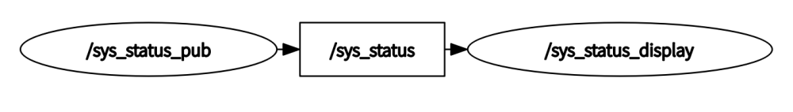

3.4.1 Completing the Engineering Architecture Design
======================================

This is your first hands-on project, and as your mentor, I believe it’s essential to guide you through it from the very beginning. When you receive a task or project, the first step is always to clarify the requirements. As the proposer of this project, I will now reiterate the requirements for this small tool.

First, this tool should display real-time system status information, including the timestamp of the recorded data, hostname, CPU usage, memory usage, total memory size, available memory, network data received, and network data sent. Second, there should be a simple interface to display this system information. Third, the data should be viewable from other hosts within the local area network.

After reading these requirements, you might feel unsure about where to start. Don’t worry—let me briefly summarize the main functionalities of this tool: First, it must be able to retrieve system status information. Second, it needs a display interface. Third, it should be able to share the data. Python offers many useful libraries that make it easy to fetch system status data, while C++ can efficiently utilize QT for interface display. Additionally, ROS 2 automatically discovers other nodes within the local network, so we only need to publish the system status via a topic.Therefore, we can write a Python node to collect system information and publish it via a topic, then develop a C++ display node to subscribe to this topic and present the data. The system architecture is illustrated in Figure 3-5.

    Figure 3-5 Small Tool System Architecture

After determining the functionality of each node in the system and the relationships between them, the overall project structure is essentially finalized. However, we know that every topic has a corresponding interface type, and ROS 2's existing interfaces do not fully meet this requirement. Therefore, we now need to define a custom interface ourselves.So, before officially writing the node code, let’s first learn how to create a custom communication interface.

