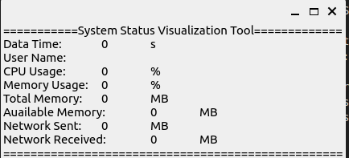
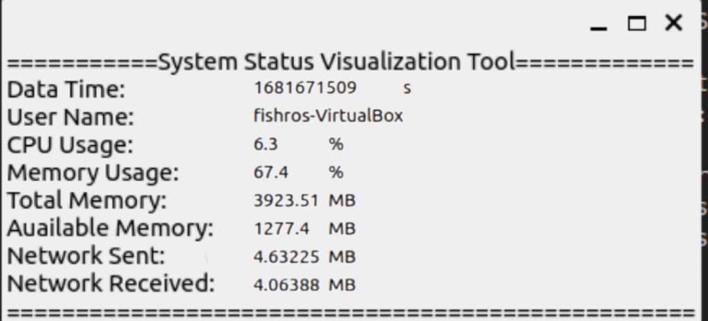

3.4.5 Subscribing to Data and Displaying with Qt
------------------------------------------------

Create a new file named `sys_status_display.cpp` under `src/status_display/src`, and then write the code from Code Listing 3-39.

**Listing 3-39: Run `hello_qt`**

.. code-block:: cpp

   #include <QApplication>
   #include <QLabel>
   #include <QString>
   #include "rclcpp/rclcpp.hpp"
   #include "status_interfaces/msg/system_status.hpp"

   using SystemStatus = status_interfaces::msg::SystemStatus;

   class SysStatusDisplay : public rclcpp::Node {
   public:
     SysStatusDisplay() : Node("sys_status_display") {
       subscription_ = this->create_subscription<SystemStatus>(
           "sys_status", 10, [&](const SystemStatus::SharedPtr msg) -> void {
             label_->setText(get_qstr_from_msg(msg));
           });
       // Create an empty SystemStatus object and convert it to a QString for display
       label_ = new QLabel(get_qstr_from_msg(std::make_shared<SystemStatus>()));
       label_->show();
     }

     QString get_qstr_from_msg(const SystemStatus::SharedPtr msg) {
       // TODO: Extract and assemble the content of msg into a string
       return QString::fromStdString("");
     }

   private:
     rclcpp::Subscription<SystemStatus>::SharedPtr subscription_;
     QLabel* label_;
   };

Here, we first include the relevant Qt header files, followed by the `rclcpp` and the custom interface-generated `system_status.hpp` header file. To make the code more readable and concise, we use the `using` directive to create an alias `SystemStatus` for `status_interfaces::msg::SystemStatus`. We then define a `SysStatusDisplay` class that inherits from `rclcpp::Node`. In the constructor, the node name is directly set to `sys_status_display`. Below that, we initialize the subscription_ using `create_subscription`, with a Lambda expression as the callback function. The `&` symbol in the Lambda expression's parameter list indicates that it can capture external variables by reference, which is why we can directly call `label_` to set the text within the expression. After initializing the subscriber, we continue to initialize `label_`, using a nested function call. First, we create an empty `SystemStatus` message and then convert it to a `QString` object for display using `get_qstr_from_msg`.

Next, we complete the `get_qstr_from_msg` method by adding the code shown in Code Listing 3-40.

**Listing 3-40: Run `hello_qt`**

.. code-block:: cpp

   QString get_qstr_from_msg(const SystemStatus::SharedPtr msg) {
     std::stringstream show_str;
     show_str
         << "===========System Status Visualization Tool============\n"
         << "Data Time:\t" << msg->stamp.sec << "\ts\n"
         << "Host Name:\t" << msg->host_name << "\t\n"
         << "CPU Usage:\t" << msg->cpu_percent << "\t%\n"
         << "Memory Usage:\t" << msg->memory_percent << "\t%\n"
         << "Total Memory:\t" << msg->memory_total << "\tMB\n"
         << "Available Memory:\t" << msg->memory_available << "\tMB\n"
         << "Network Sent:\t" << msg->net_sent << "\tMB\n"
         << "Network Received:\t" << msg->net_recv << "\tMB\n"
         << "==========================================";

     return QString::fromStdString(show_str.str());
   }

In Code Listing 3-40, we use `std::stringstream` and its `<<` operator to extract the data from `msg` and assemble it. We only use the seconds part of the timestamp. Then, we convert it to a `std::string` using the `str()` member function and pass it to the `QString::fromStdString` function to generate a `QString` object and return it.

Finally, we write the main function. At the end of Code Listing 3-40, add the code shown in Code Listing 3-41.

**Listing 3-41: Run `hello_qt`**

.. code-block:: cpp

   int main(int argc, char* argv[]) {
     rclcpp::init(argc, argv);
     QApplication app(argc, argv);
     auto node = std::make_shared<SysStatusDisplay>();
     std::thread spin_thread([&]() -> void { rclcpp::spin(node); });
     spin_thread.detach();
     app.exec();
     rclcpp::shutdown();
     return 0;
   }

We know that both `rclcpp::spin` and `app.exec` will block the program's execution. If `rclcpp::spin` is called first, `app.exec` will not be executed, and Qt-related events will not be processed, resulting in a failure to display the interface properly. Conversely, if `app.exec` is called first, `rclcpp::spin` will not be executed, and ROS 2 will not be able to handle events properly, leading to a failure in receiving and sending data. Therefore, in the code above, we use multithreading to handle `spin` in a separate thread. When the interface exits and `app.exec` exits, we call `rclcpp::shutdown`, which will automatically terminate the `spin_thread`, and the program will exit normally.

After writing the code, modify `CMakeLists.txt` and add the commands from Code Listing 3-42 to register the `sys_status_display` node.

**Listing 3-42: Run `hello_qt`**

.. code-block:: cmake

   ...
   add_executable(sys_status_display src/sys_status_display.cpp)
   target_link_libraries(sys_status_display Qt5::Widgets)  # Use native CMake commands for non-ROS packages to link libraries
   ament_target_dependencies(sys_status_display rclcpp status_interfaces)

   install(TARGETS
     hello_qt
     sys_status_display
     DESTINATION lib/${PROJECT_NAME})
   ...
   ament_package()

Finally, build and run the node. The result is shown in Figure 3-7.

    Figure 3-7 Default Display Result

Since no publisher has been started, there is no data available. Open a new terminal, start the publisher, and then observe the interface again. The result is shown in Figure 3-8.

    Figure 3-8 The display result after receiving the topic data.

Well, seeing the data constantly updating on the interface must make you feel pretty happy, right? Yes, this project involves a lot of new knowledge, and it's not easy. But anyway, your first hands-on project has been successfully completed, and you surely want to keep it well preserved. So, in the next section, let's learn about the version control tool Git, which will help us manage our code better. Take a short break, and then complete the rest of this chapter in one go.